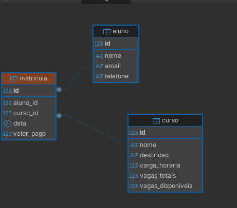

# Escola de Cursos Livres — MVC + JDBC + PostgreSQL

Sistema de gerenciamento de escola de cursos livres desenvolvido em Java com padrão MVC, JDBC puro e banco de dados PostgreSQL.

---

## Pré-requisitos

| Ferramenta | Versão mínima |
|------------|---------------|
| Java (JDK) | 17            |
| Maven      | 3.8+          |
| PostgreSQL | 14+           |

---

## Estrutura do Projeto

```
escola-cursos-livres/
├── pom.xml
└── src/main/java/com/escola/
    ├── Main.java                      ← Ponto de entrada (demonstra o fluxo completo)
    ├── model/
    │   ├── Aluno.java
    │   ├── Curso.java
    │   └── Matricula.java
    ├── repository/                    ← Acesso ao banco via JDBC
    │   ├── AlunoRepository.java
    │   ├── CursoRepository.java
    │   └── MatriculaRepository.java
    ├── service/                       ← Regras de negócio
    │   ├── AlunoService.java
    │   ├── CursoService.java
    │   └── MatriculaService.java
    ├── controller/                    ← Coordena Service e exibe resultados
    │   ├── AlunoController.java
    │   ├── CursoController.java
    │   └── MatriculaController.java
    └── util/
        └── Conexao.java               ← Configuração da conexão com o banco
```

---

## Diagrama ER



---

## Configuração do Banco de Dados

### 1. Crie o banco no PostgreSQL

```sql
CREATE DATABASE d_escola_cursos;
```

### 2. Execute os scripts abaixo na ordem (respeita as foreign keys)

```sql
CREATE TABLE aluno (
    id        SERIAL PRIMARY KEY,
    nome      VARCHAR(100) NOT NULL,
    email     VARCHAR(100) NOT NULL UNIQUE,
    telefone  VARCHAR(20)
);

CREATE TABLE curso (
    id                 SERIAL PRIMARY KEY,
    nome               VARCHAR(100) NOT NULL,
    descricao          TEXT,
    carga_horaria      INT NOT NULL,
    vagas_totais       INT NOT NULL,
    vagas_disponiveis  INT NOT NULL CHECK (vagas_disponiveis >= 0)
);

CREATE TABLE matricula (
    id          SERIAL PRIMARY KEY,
    aluno_id    INT            NOT NULL,
    curso_id    INT            NOT NULL,
    data        DATE           NOT NULL,
    valor_pago  NUMERIC(10, 2) NOT NULL CHECK (valor_pago >= 0),
    CONSTRAINT fk_matricula_aluno       FOREIGN KEY (aluno_id) REFERENCES aluno(id) ON DELETE RESTRICT,
    CONSTRAINT fk_matricula_curso       FOREIGN KEY (curso_id) REFERENCES curso(id) ON DELETE RESTRICT,
    CONSTRAINT uq_matricula_aluno_curso UNIQUE (aluno_id, curso_id)
);

CREATE INDEX idx_matricula_aluno ON matricula(aluno_id);
CREATE INDEX idx_matricula_curso ON matricula(curso_id);
```

### 3. Configure a conexão

Abra `src/main/java/com/escola/util/Conexao.java` e ajuste os dados:

```java
private static final String URL      = "jdbc:postgresql://localhost:5432/d_escola_cursos";
private static final String USER     = "postgres";   // seu usuário PostgreSQL
private static final String PASSWORD = "postgres";   // sua senha PostgreSQL
```

---

## Como Executar

### Via IntelliJ IDEA

1. `File → Open` → selecione a pasta **`escola-cursos-livres`**
2. Aguarde o Maven baixar as dependências automaticamente
3. Abra `src/main/java/com/escola/Main.java`
4. Clique no botão **▶ Run** ao lado do método `main`

### Via terminal (Maven)

```bash
mvn compile
mvn exec:java
```

---

## Regras de Negócio

| # | Regra |
|---|-------|
| 1 | Não é permitido matricular aluno em curso sem vagas — lança `IllegalStateException` |
| 2 | Não é permitido matricular o mesmo aluno duas vezes no mesmo curso — lança `IllegalStateException` |
| 3 | Valor pago não pode ser negativo — lança `IllegalArgumentException` |
| 4 | Aluno e Curso devem estar cadastrados antes da matrícula — lança `IllegalArgumentException` se não encontrado |
| 5 | Ao concluir matrícula com sucesso, `vagas_disponiveis` do curso é decrementado em 1 |
| 6 | É possível listar todos os alunos de um determinado curso |
| 7 | É possível listar todos os cursos em que um aluno está matriculado |

---

## O que o `Main.java` demonstra

1. Cadastra dois alunos (`Ana Lima` e `Bruno Costa`)
2. Cadastra um curso (`Java para Iniciantes`, 40h, **1 vaga**)
3. Matricula `Ana Lima` com sucesso (vagas: 1 → 0)
4. Tenta matricular `Ana Lima` novamente no mesmo curso — exibe erro (matrícula duplicada)
5. Tenta matricular `Bruno Costa` — exibe erro (curso sem vagas)
6. Lista todos os alunos do curso
7. Lista todos os cursos de `Ana Lima`

---

## Exemplo de saída

```
=== ESCOLA DE CURSOS LIVRES ===

--- Cadastrando alunos ---
[Aluno] Cadastrado com sucesso: Aluno{id=1, nome='Ana Lima', email='ana@email.com', telefone='11977770000'}
[Aluno] Cadastrado com sucesso: Aluno{id=2, nome='Bruno Costa', email='bruno@email.com', telefone='11966660000'}

--- Cadastrando curso (1 vaga) ---
[Curso] Cadastrado com sucesso: Curso{id=1, nome='Java para Iniciantes', cargaHoraria=40h, vagasTotais=1, vagasDisponiveis=1}

--- Matriculando aluno1 (deve ter sucesso, vagas: 1→0) ---
[Matricula] Realizada com sucesso: Matricula{id=1, alunoId=1, cursoId=1, data=2026-06-24, valorPago=299.90}

--- Tentativa de matrícula duplicada do aluno1 (deve falhar) ---
[Matricula] Erro: Aluno 'Ana Lima' já está matriculado no curso 'Java para Iniciantes'.

--- Tentativa de matrícula do aluno2 (curso sem vagas — deve falhar) ---
[Matricula] Erro: Curso 'Java para Iniciantes' não possui vagas disponíveis.

--- Alunos do curso ---
[Curso] Alunos do curso id=1: 1
  Aluno{id=1, nome='Ana Lima', email='ana@email.com', telefone='11977770000'}

--- Cursos do aluno1 ---
[Aluno] Cursos do aluno id=1: 1
  Curso{id=1, nome='Java para Iniciantes', cargaHoraria=40h, vagasTotais=1, vagasDisponiveis=0}

=== FIM DO FLUXO ===
```
